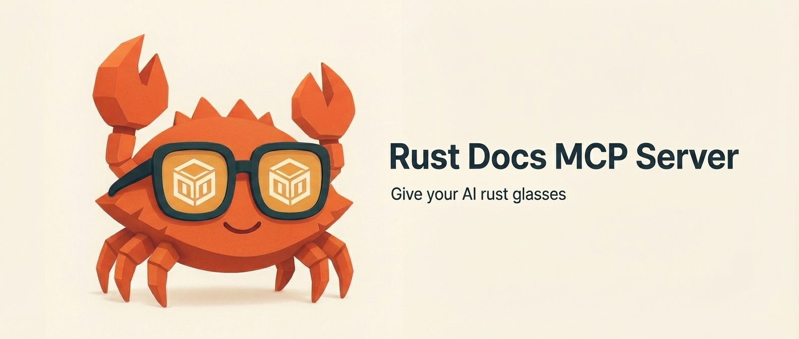

[](https://github.com/snowmead/rust-docs-mcp)

# Rustdocs MCP Server

_Rust is the language of AI_

An MCP (Model Context Protocol) server that provides comprehensive access to Rust crate documentation, source code analysis, dependency trees, and module structure visualization. Built for agents to gain quality insights into Rust projects and build with confidence.

## The Problem: Agents Building in the Dark

The rise of AI agents has revolutionized software development, with new tools and libraries emerging at an unprecedented pace. However, this rapid evolution creates a critical challenge: **agents cannot reliably build with tools they weren't trained on**.

When an agent tries to use a new Rust crate:

- 🚫 **Training data is outdated** — The model hasn't seen recent crates or API changes
- 🚫 **Documentation scraping is inefficient** — Web scraping GitHub or docs.rs is slow and unreliable
- 🚫 **Examples aren't enough** — Copy-pasting README examples provides surface-level understanding
- 🚫 **Internal structure is opaque** — Agents can't explore how modules, traits, and types interconnect

This leads to frustrated developers watching their agents fail repeatedly, guessing at APIs, and producing broken code.

## The Solution: Deep Crate Intelligence

This MCP server gives agents the tools they need to **truly understand** Rust crates:

- 🔍 **Explore internal structure** — Navigate module hierarchies and type relationships
- 📖 **Access complete documentation** — Full rustdoc with signatures, fields, and methods
- 🔗 **Trace dependencies** — Understand what a crate depends on and why
- 💾 **Work offline** — Cache crates locally for instant, reliable access
- 🎯 **Query precisely** — Search by pattern, kind, or path to find exactly what's needed

With these capabilities, agents can build confidently with any Rust crate — even ones released yesterday.

## Agent Capabilities

- [x] **Multi-source caching** — crates.io, GitHub repositories, local filesystem paths
- [x] **Workspace support** — Individual member analysis and caching for cargo workspaces
- [x] **Documentation search** — Pattern matching with kind/path filtering and preview modes
- [x] **Item inspection** — Detailed signatures, fields, methods, and documentation strings
- [x] **Source code access** — Line-level precision with parameterized surrounding context
- [x] **Dependency analysis** — Direct and transitive dependency trees with metadata
- [x] **Module structure** — Hierarchical tree generation via cargo-modules integration
- [x] **Offline operation** — Full functionality after initial crate caching
- [x] **Token management** — Response truncation and preview modes for LLM compatibility

## MCP Tools

### Cache Management

- `cache_crate_from_cratesio` - Download and cache a specific crate version from crates.io
- `cache_crate_from_github` - Download and cache from GitHub (specify branch or tag)
- `cache_crate_from_local` - Cache from a local file system path
- `remove_crate` - Remove cached crate versions to free disk space
- `list_cached_crates` - View all cached crates with versions and sizes
- `list_crate_versions` - List cached versions for a specific crate
- `get_crates_metadata` - Batch metadata queries for multiple crates

### Documentation Queries

- `search_items_preview` - Lightweight search returning only IDs, names, and types
- `search_items` - Full search with complete documentation (may hit token limits)
- `list_crate_items` - Browse all items in a crate with optional filtering
- `get_item_details` - Detailed information about specific items (signatures, fields, etc.)
- `get_item_docs` - Extract just the documentation string for an item
- `get_item_source` - View source code with configurable context lines

### Dependency Analysis

- `get_dependencies` - Analyze direct and transitive dependencies with filtering

### Structure Analysis

- `structure` - Generate hierarchical module tree using integrated cargo-modules

## Configuration

### Cache Directory

By default, crates are cached in `~/.rust-docs-mcp/cache/`. You can customize this location using:

```bash
# Command line option
rust-docs-mcp --cache-dir /custom/path/to/cache
# or set the environment variable
export RUST_DOCS_MCP_CACHE_DIR=/custom/path/to/cache
rust-docs-mcp
```

### Each crate version stores

- Complete source code in `source/` directory
- Cache metadata and timestamps in `metadata.json`
- For workspace crates, individual members in `members/` directory:
  - `members/{member-name}/docs.json` - Rustdoc JSON documentation
  - `members/{member-name}/dependencies.json` - Cargo dependency metadata
  - `members/{member-name}/metadata.json` - Member-specific cache metadata
- For single crates:
  - `docs.json` - Rustdoc JSON documentation
  - `dependencies.json` - Cargo dependency metadata

## Installation

### Quick Install

```bash
curl -sSL https://raw.githubusercontent.com/snowmead/rust-docs-mcp/main/install.sh | bash
```

### Installation Options

#### One-liner (Recommended)

```bash
curl -sSL https://raw.githubusercontent.com/snowmead/rust-docs-mcp/main/install.sh | bash
```

#### Custom install directory

```bash
curl -sSL https://raw.githubusercontent.com/snowmead/rust-docs-mcp/main/install.sh | bash -s -- --install-dir /usr/local/bin
```

#### Building from Source

> **Note:** This crate is not yet published to crates.io because it depends on `rmcp` which is awaiting its first release.

##### Requirements

- Rust nightly toolchain (for Rustdoc JSON generation)

  ```bash
  rustup toolchain install nightly
  ```

- Network access to download crates from [crates.io](https://crates.io)

```bash
git clone https://github.com/snowmead/rust-docs-mcp
cd rust-docs-mcp/rust-docs-mcp
cargo build --release
./target/release/rust-docs-mcp install
```

### CLI Commands

```bash
rust-docs-mcp                   # Start MCP server
rust-docs-mcp install           # Install to ~/.local/bin
rust-docs-mcp install --force   # Force overwrite existing installation
rust-docs-mcp --help            # Show help
```

### MCP Configuration

Add the server to your MCP configuration:

```json
{
  "rust-docs": {
    "command": "/path/to/rust-docs-mcp/target/release/rust-docs-mcp",
    "transport": "stdio"
  }
}
```

## Star History

<a href="https://www.star-history.com/#ryoppippi/ccusage&Date">
    <picture>
        <source media="(prefers-color-scheme: dark)" srcset="https://api.star-history.com/svg?repos=snowmead/rust-docs-mcp&type=Date&theme=dark" />
        <source media="(prefers-color-scheme: light)" srcset="https://api.star-history.com/svg?repos=snowmead/rust-docs-mcp&type=Date" />
        
    </picture>
</a>
